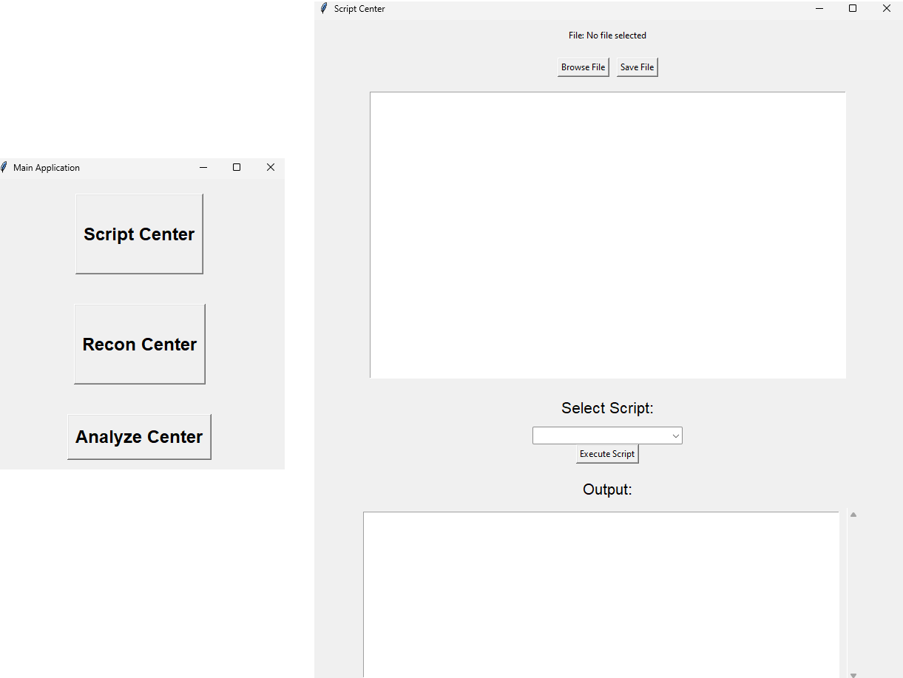

# WorkCenter

Script Center is a simple GUI application that allows you to browse, edit, save, and execute script files from various programming languages. It supports Python (.py), Shell (.sh), and PowerShell (.ps1) script files. The application provides a text editor to modify the script contents and a combobox to select and execute loaded scripts.

## Features

- Browse and select a script file from your computer.
- Save the currently selected script file in the "loaded_scripts" folder.
- Edit the script contents using the built-in text editor.
- Execute selected scripts and display their output in the application.

## Prerequisites

To run this application, ensure you have the following:

- Python 3.x or later installed on your system.
- The Tkinter library, which comes pre-installed with Python.

## How to Use

1.  Download the `script_center.py` file to your computer.

2.  Open a terminal or command prompt and navigate to the folder containing `script_center.py`.

3.  Execute the following command to start the Script Center application:

Copy code

`python script_center.py`

Save to grepper

1.  The application window will open, allowing you to perform various actions.

### Select and Save Script

- Click the "Browse File" button to select a script file from your computer.
- Once the file is selected, the script contents will be displayed in the text editor.
- Click the "Save File" button to save the edited script in the "loaded_scripts" folder.

### Display and Modify Script

- Use the text editor to view and edit the script contents.
- To save changes, press `Ctrl + S` or click the "Save File" button.

### Select and Execute Script

- After saving the script, the combobox will be populated with the list of loaded script files.
- Select a script from the combobox that you wish to execute.
- Click the "Execute Script" button to run the selected script.

### Script Output

- The output of the executed script will be displayed in the output text widget.

## Supported Script Types

Script Center supports the execution of Python (.py), Shell (.sh), and PowerShell (.ps1) script files.

## Note

- Make sure to move the script files you want to execute into the "loaded_scripts" folder within the same directory as `script_center.py`.

- The application will prompt for confirmation before executing a script.

- If the script execution encounters any errors, the error message will be displayed in the output text widget.

Enjoy using Script Center for managing and running your scripts efficiently!

# ReconCenter Class - Nmap Scan GUI

The `ReconCenter` class is a graphical user interface (GUI) for performing Nmap scans. Nmap is a powerful network scanning tool used for exploration and security auditing. This class allows users to input scan parameters and initiate different types of Nmap scans through the GUI.

## Getting Started

To use the ReconCenter class, follow these steps:

1.  Ensure you have Python installed on your system.
2.  Install the required dependencies (e.g., `tkinter`).
3.  Copy the `ReconCenter` class into your project or script.

## Prerequisites

The `ReconCenter` class relies on `tkinter`, which is a standard Python library for creating graphical user interfaces. Make sure you have it installed before using the class.

## Usage

1.  Import the necessary libraries, including `tkinter`.
2.  Create an instance of the `ReconCenter` class.
3.  Run the Tkinter event loop to display the GUI.
4.  Use the provided input box to enter the desired scan parameters.
5.  Click on one of the scan type buttons to initiate the Nmap scan.
